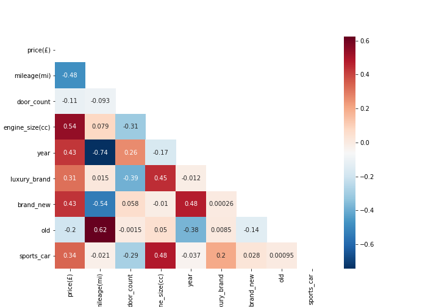
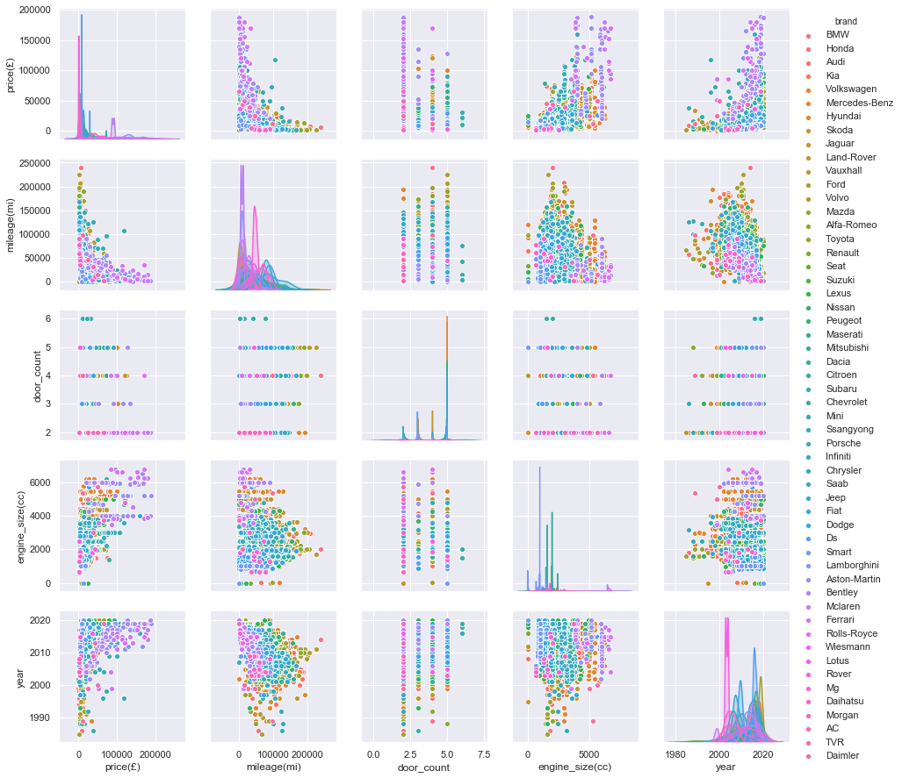

# Predicting Car Prices using Machine Learning

Within this repo, I created a regression model that predicts car prices.
I found that by doing so, I would be able to aid people like me (a year ago) who needed to sell/buy a car and had no idea what a fair price is.

# Contents

1. [Presentation Slides](https://drive.google.com/file/d/1mDAKD81HligeDWsKDlGVd0qk2NiRACtr/view?usp=sharing)
2. [Data Gathering](https://github.com/PaulWill92/predict-car-prices/blob/master/Jupyter-Notebooks/01-Data_Gathering.ipynb)
3. [Data frame](https://github.com/PaulWill92/predict-car-prices/blob/master/Cleaned-Data/cleaned_cars.csv)
4. [Data Cleaning](https://github.com/PaulWill92/predict-car-prices/blob/master/Jupyter-Notebooks/02-data_cleaning.ipynb)
5. [Data Exploration](https://github.com/PaulWill92/predict-car-prices/blob/master/Jupyter-Notebooks/03-Data_Exploration.ipynb)
6. [Data Modeling](https://github.com/PaulWill92/predict-car-prices/blob/master/Jupyter-Notebooks/04-Data_Modeling.ipynb)

Use this [app](In progress) to predict price

My Socials:

- [My email](paulaleksis@gmail.com)
- [My Linked](WWW.LINKEDIN.COM/IN/PAUL-ALEKSIS-406776199)
- [My Twitter](in progress)

### Executive Summary

When I was moving to England from America, I had to sell my car. At that time I did a lot of googling and research to try to figure out what the fair market price was. Through my research, I was able to narrow down a fair price. I noticed a lot of fluctuation between car prices even among cars that were the same make and model as my car. What if at that time, I could have created a machine learning algorithm that could have done all that research for me. The problem this repo is going to solve is as follows: **Can I use machine learning to predict car prices based off certain features?**

In order to help solve this problem, I recognized the parameters of my problem:

1. The outcome I am trying to figure out is a single outcome (univariate)
2. I will need many features of a car to figure out its price (multivariable)
3. The price can be a minimum or maximum value of a specific currency (continuous variable)
4. The features and price of the data I will extract are labeled (supervised)

Knowing the above parameters, I know that In order to solve my problem, I am able to use a regressor.

### Methodology

To get started, I created a web crawling script [here](https://github.com/PaulWill92/predict-car-prices/blob/master/Jupyter-Notebooks/01-Data_Gathering.ipynb) to extract features of certain up to date cars from the [website](https://www.autovillage.co.uk/used-car/filter/bodystyle/saloon). I was able to store these values in a list, form a data frame out of the list values, and save that data frame as a [csv file](https://github.com/PaulWill92/predict-car-prices/blob/master/Cleaned-Data/cleaned_cars.csv).

After extracting my data, I began cleaning the data set to provide the correct format for modeling in this [Jupyter Notebook](https://github.com/PaulWill92/predict-car-prices/blob/master/Jupyter-Notebooks/02-data_cleaning.ipynb). I utilized many string manipulation techniques to split my features into seperate columns. By the end of the cleaning, I was left with 1 target variable and 8 predictors.

After data cleaning, I explored my data set looking for linear correlations between my target variable and predictors. I also checked for multicollinearity between my predictors.

I created a pairplot to check for outliers within my data set.

After exploration, I proceeded to model you can find my modeling in this [Jupyter Notebook](https://github.com/PaulWill92/predict-car-prices/blob/master/Jupyter-Notebooks/04-Data_Modeling.ipynb). Since my data set contained multiple categorical values, I had to encode them to be able to use within my baseline model. Once encoded, I split up my data set into 4 sets; train, validation, and test. From these sets, I ran my baseline which scored negatively with all of my features included. After this model, I removed my model variable as it had way too much variance and was throwing off my models predictability. With this change, I was able to get my model to a reasonable 0.65 R-squared.

I tried out other models such as ridge, lasso, and polynomial to the 2nd degree regression. These models did not score as high.

As of now, My best model is my Linear regression with a .65 R-squared. I will do some feature engineering to improve this model and try a random forrest regressor.

To Improve my model, I would extract more features from other auto sale websites and add it to my model because for the most part, my model is underfit.
